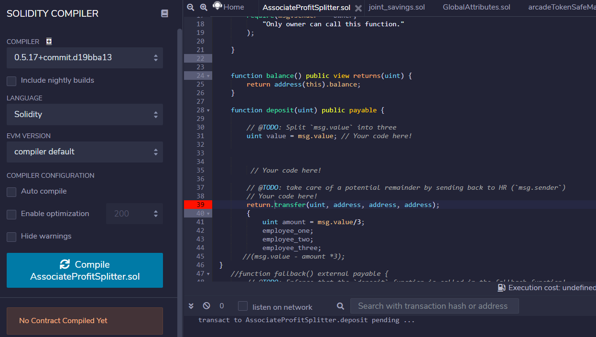
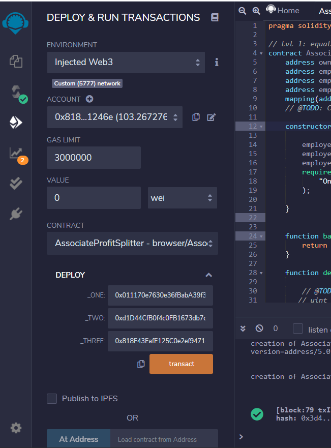
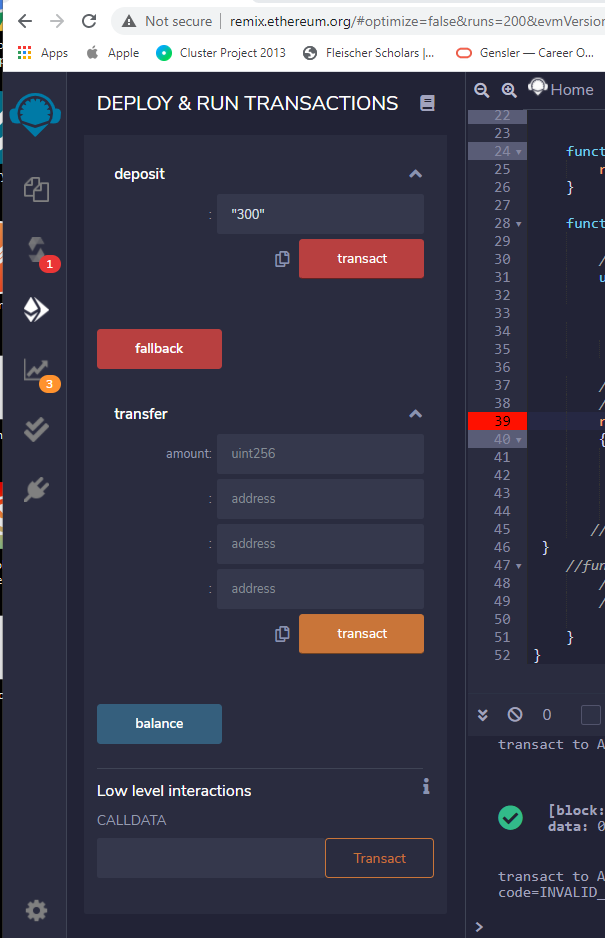

# Unit_20_Homework
## Associate Profit Splitter Contract
Contract designed to allow profits to be deposited into the contract and then split equally between 3 separate employees. The employee addresses are listed during the contract deployment, as they are part of the constructors.  

I had trouble creating the transfer function inside of the deposit function, as they should not be separate events, but the deposit should trigger and automatic transfer. Errors with various variables and functions required commenting out certain function lines to deploy the contract. 

Contract deployed at limited functionality. 

